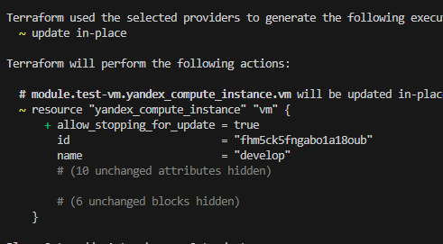

Задание 1.

    1. Взят и немного изменен модуль из демонстрации
 


    2. Используется переменная для ssh в "cloud-init.yml" -->
   


    сама переменная помещена в 


    3. Установлен "nginx" с помощью "cloud-init"


    4. Вывод команды ``sudo nginx -t```
   


Ссылка на коммит задание 1.

https://github.com/NeTrogajSvetchu/ter-homeworks-04/commit/910a9ce6821e0ef1cc295040d9de9dc26362029f


Задание 2.

    1. Создан локальный модуль "vpc_dev"


    2. Написаны переменные 


    3. Вывод команды module.vpc_dev в консоли terraform


    4. Заменил значения в модуле 


    5. Вывод команды terraform apply


    6. Установлен  terraform-docs. Создан документ путем вывода команды "terraform-docs markdown . > doc.md" файл в корне репозитория src/doc.md
    
Ссылка на коммит задание 2.

https://github.com/NeTrogajSvetchu/ter-homeworks-04/commit/6a6ceb4287f2fcbf9e31eefd4a3b25ede6abeed3

Задание 3.

    1. Для вывода ресурсов необходимо ввести данную команду 
   
   "terraform state list"


    2. Удалил полностью два модуля командой 

    "terraform state rm module.vpc_dev module.test-vm"


    1.  Команды восстановления стейта
   
   terraform state list

   terraform import 'module.test-vm.data.yandex_compute_image my_image' f2edjaaou81nlio0t33s

   terraform import 'module.vpc_dev.yandex_vpc_network.develop' enptun2matcvj5m343nt

   terraform import 'module.vpc_dev.yandex_vpc_subnet.develop' e9b0ord6euhkn8mhnanf

   terraform plan
   
   

   Если скопировать "terraform.tfstate.*.backup" в terraform.tfstate то ошибки не произойдет

Ссылка на коммит задание 3.
Отправьте пожалуйста на доработку. Не успеваю доделать доп. задания