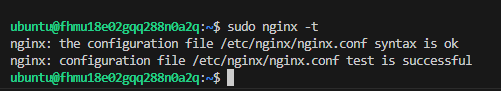
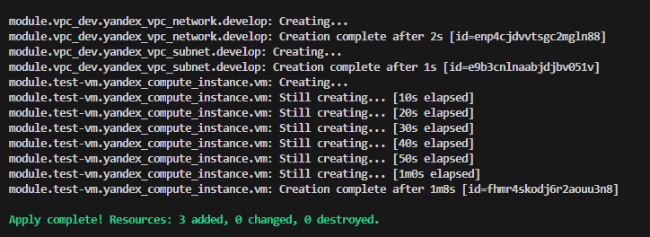

Задание 1.

    1. Взят и немного изменен модуль из демонстрации
 


    2. Используетсья переменная для ssh в "cloud-init.yml"
   


    сама переменная помещена в 


    1. Установленн "nginx" с помощью "cloud-init"


    4. Вывод команды ``sudo nginx -t```
   


Сылка на комит задание 1.

https://github.com/NeTrogajSvetchu/ter-homeworks-04/commit/910a9ce6821e0ef1cc295040d9de9dc26362029f


Задание 2.

    1. Создан локальный модуль "vpc_dev"


    2. Написанны переменные 


    3. Вывод команды module.vpc_dev в консоли terraform


    4. Заменил значения в модуле 


    5. Вывод команды terraform apply



    6. Установлен  terraform-docs. Создан документ путем вывода комманды "terraform-docs markdown . > doc.md" файл в корне репозитория src/doc.md
    